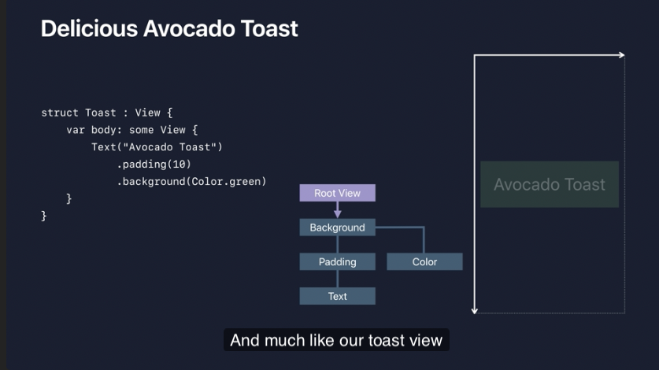

### 주저리 주저리

# Layout Procedure

1. Parent propose s asize for child
   
2. Child chooses its own size
   - 각 Child 뷰들은 자신이 갖고있는 사이즈가 있습니다.(이것이 Extend하는지 아니면, 일정 사이즈를 갖는지)

3. Parent places child in parent’s coordinate space

4. SwiftUI rounds coordinates to nearest pixel
    - 프레임 워크가 알아서 해줌

# Example

1. root View 가 background view에게 사이즈를 제안함
2. background view는 레이아웃이 자연스럽게 잡힘
3. padding이 있는 뷰에게 사이즈를 제안함(레이아1111웃이 잡힐 수 있게)
4. 패딩 뷰는 자식 뷰에게 가용한 사이즈를 제안하고, 자식 뷰는 해당 사이즈 중 필요한 만큼 사용합니다. 그 후 패딩 뷰는 자식 뷰의 크기에 10포인트씩 추가하여 최종 크기를 계산하고 레이아웃을 설정합니다.
5. 배경 뷰(background view)는 레이아웃에 중립적이므로, 제안된 사이즈를 받아들이고, 이를 자신의 보조 자식인 색상(color)에게 제안합니다. 색상은 제공된 사이즈를 그대로 받아들여, 패딩 뷰와 동일한 크기를 가집니다.
6. 배경 뷰는 최종적으로 그 크기를 루트 뷰(root view)에게 보고하고, 루트 뷰는 이전과 마찬가지로 배경 뷰를 중앙에 배치합니다.

# SwiftUI에서의 Frame
- SwiftUI에서 frame은 제약 조건이 아니라, 그냥 그림 프레임처럼 생각할 수 있는 뷰일 뿐이라는 점을 인식하는 것이 중요합니다.
- 이 frame은 자식 뷰에게 고정된 치수를 제안하지만, 다른 모든 뷰와 마찬가지로 자식 뷰는 결국 자신의 크기를 선택합니다.

# layout priority

- 만약 View가 표시할 display할 만큼의 크기를 갖지 않아 줄어들게 될 경우, 개발자가 manually layoutpriorit modifier를 적용할 수 있습니다. 
- `.layoutPriority(priorityValue)` priorityValue는 1과 0 사이의 값으로 조정 가능합니다.
- Sets the priority by which a parent layout should apportion space to this child. 