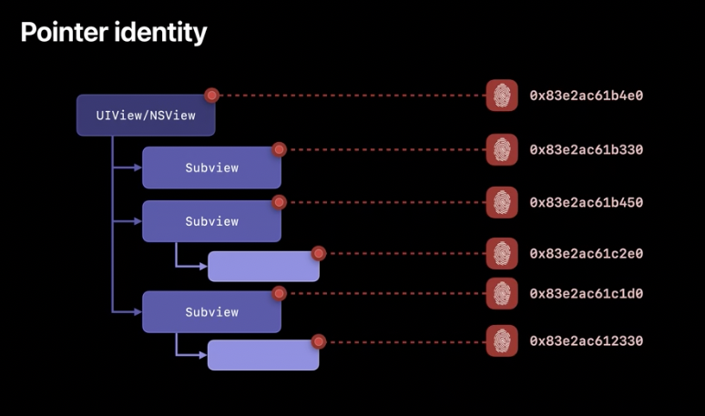
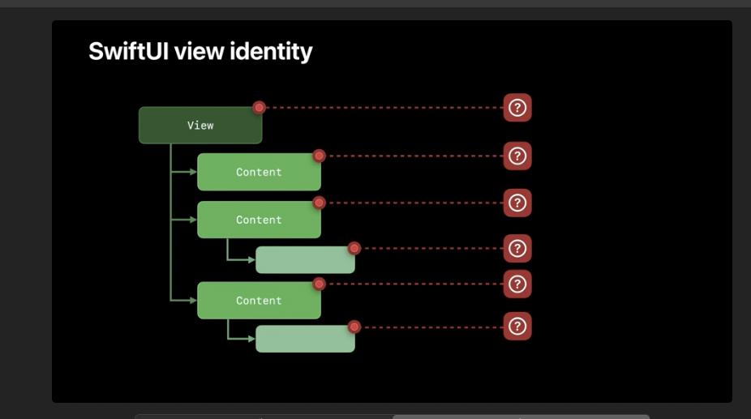
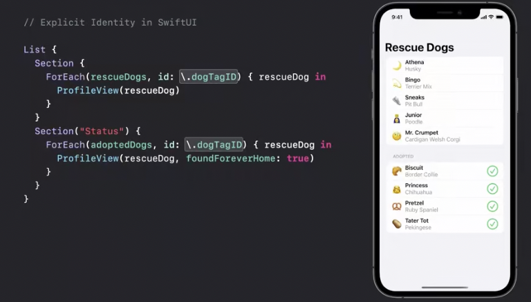
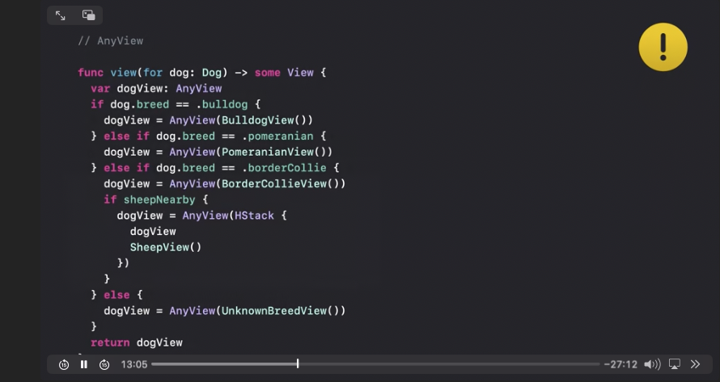
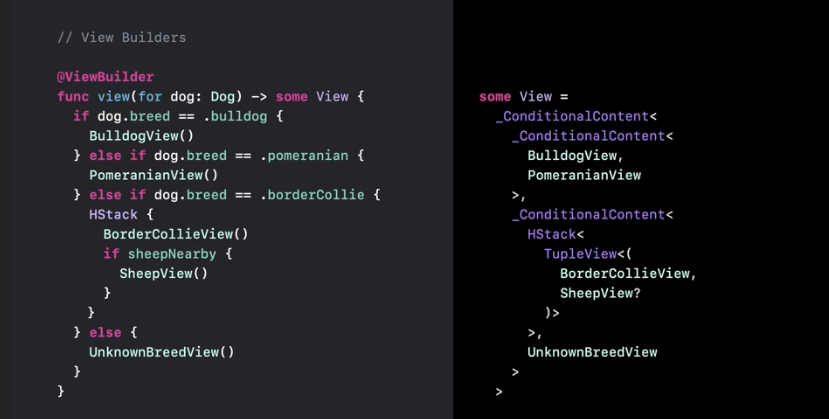
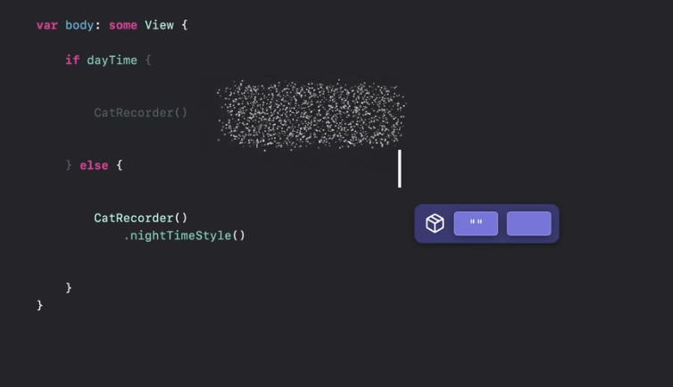
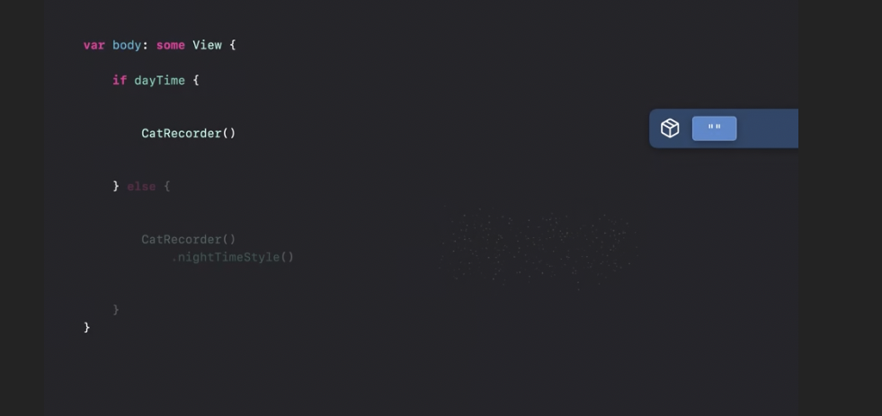
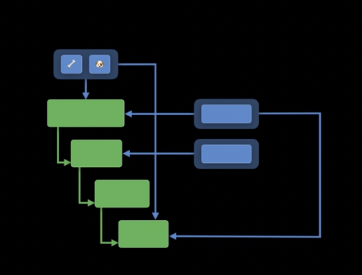
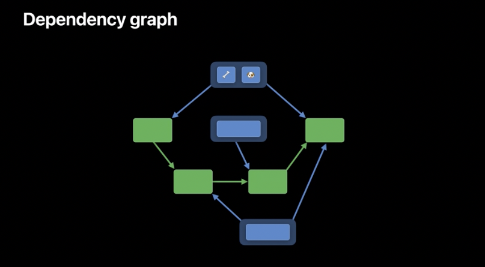

## Identity

### Identity is Implict or Explict?
- UIKit 에서는 묵시적인 Pointer를 통한 Identity를 구별함
- SwiftUI 에서는 그러지 않음

### SwiftUI에서 id를 사용하기
SwiftUI에서는 ID를 통해서 어떤 값이 바뀌었는지를 확인합니다. 

### SwiftUI에서 some View를 리턴할 때 @ViewBuilder 를 선언하는 이유
- 이는 SwiftUI가 헬퍼 함수에서 단일 리턴 타입을 요구하기 때문입니다.
- View 프로토콜은 body 프로퍼티를 특별하게 취급한다는 점을 기억하세요. 이 프로퍼티는 ViewBuilder로 암묵적으로 감싸집니다.
- 이것은 프로퍼티의 논리를 단일하고 제네릭한 뷰 구조로 변환합니다.
- 현재 Swift는 기본적으로 헬퍼 함수가 view builder라고 추론하지 않지만, ViewBuilder 속성을 수동으로 적용함으로써 이를 선택할 수 있습니다.
- 그리고 결과의 타입 서명을 보면, 이제 함수의 조건부 논리를 조건부 콘텐츠의 트리 구조로 정확하게 복제하여 SwiftUI에 뷰와 그 구성 요소의 정체성에 대한 훨씬 더 풍부한 관점을 제공합니다.

|이전|이후|
|:-:|:-:|
|||

### AnyView를 지양해야하는 이유
- 읽고 이해하기 힘듬
- 컴파일타임에 에러가 발생할 수 있음
- 성능 저하

### Identity 특성
- 안정적인 Element를 시간의 변화에 상관없이 제공하게(가능하게 함)

### 상태 지속성에대한 Practice
- 처음 body를 평가하고 실제 브랜치에 들어가면 SwiftUI가 초기 값으로 상태에 대한 퍼시스턴트 스토리지를 할당합니다.
- 이 뷰의 수명이 다하는 동안 SwiftUI에서는 다양한 동작에 의해 변경되는 상태를 유지합니다.
- 하지만 dayTime의 값이 변경되어 잘못된 브랜치에 들어가면 어떻게 될까요? SwiftUI에서는 이것이 고유한 정체성을 가진 다른 뷰라는 것을 알고 있습니다.
- 상태의 초기 값부터 시작하여 거짓 뷰에 대한 새 스토리지를 생성하고, 참 뷰에 대한 스토리지는 바로 다음에 할당 해제됩니다.
- 하지만 실제 브랜치로 돌아간다면 어떨까요? 이는 다시 새로운 뷰이므로 SwiftUI가 상태의 초기 값부터 다시 시작하여 새 스토리지를 생성합니다.
- 여기서 중요한 점은 아이덴티티가 변경될 때마다 상태가 교체된다는 것입니다.

### Life Time 정리 (View Vlaues가 지켜야 할 지침들 )
Views value 값은 일시적인 것이므로 그 수명에 의존해서는 안 됩니다.
그러나 뷰의 정체성은 그렇지 않으며 시간이 지나도 지속성을 유지합니다.
뷰의 정체성을 제어할 수 있으며, 정체성을 사용하여 상태의 수명을 명확하게 지정할 수 있습니다.
마지막으로 SwiftUI는 데이터 기반 구성 요소에 대해 식별 가능한 프로토콜을 최대한 활용하므로 데이터에 대한 안정적인 식별자를 선택하는 것이 중요합니다.

### Dependencies
- Dpendencies가 변하면 view는 새로운 body를 만들어야 합니다.

|tree| graph|
|:-:|:-:|
|||