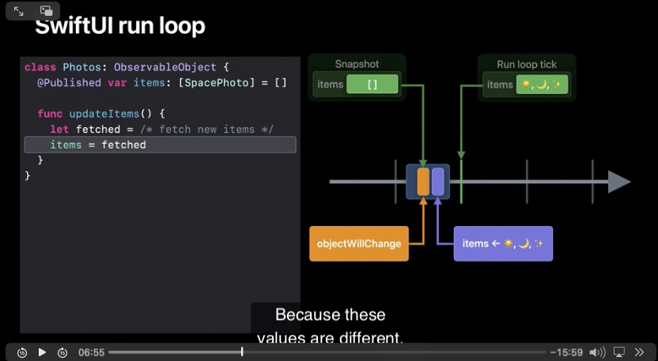
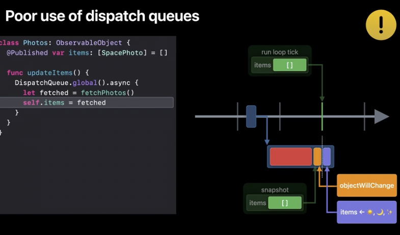

# RunLoop이란?
- RunLoop은 특정 스레드에서 들어오는 이벤트의 수신 및 처리를 조정하는 루프입니다.
- RunLoop은 모든 스레드에 존재하지만 기본적으로 대기 모드에 있으며 어떤 작업도 수행하지 않습니다.
- 필요한 경우 개발자가 실행할 수 있지만 자동으로 작동하지는 않습니다. 이렇게 하려면 코드를 작성해야 합니다.

# Runloop는 어떤 문제를 해결합니까?

- 우선, RunLoop은 들어오는 작업의 흐름을 관리하고 적시에 실행하도록 설계되었습니다.

- 이는 UIScrollView를 사용하는 등 UI 작업을 할 때 가장 두드러집니다.

- 기본적으로 기본 RunLoop은 항상 애플리케이션에서 실행됩니다. 시스템의 메시지를 처리하여 애플리케이션으로 전송합니다. 이러한 메시지의 예로는 사용자가 화면을 클릭할 때 발생하는 이벤트를 들 수 있습니다.

>보조 스레드에는 RunLoop의 필요성을 자체적으로 결정해야 합니다. 필요한 경우 직접 구성하고 실행해야 합니다. 기본적으로 RunLoop을 실행하는 것은 권장되지 않으며 스레드와의 활성 상호 작용이 필요한 경우에만 필요합니다.

# SwiftUI run loop을 통해서 업데이트 되는 과정

- updateItems 함수 호출
- update items의 target property가 @Published라면 objectWillChange 호출
- 그리고 update 하는 target Propert에 takes snapshot
- SwiftUI 프레임워크는 스냅샷과 현재 value를 비교하여 업데이트 한다.

# poor use of dispatch queueus

- 예를 들어, fetchPhotos 함수가 다운로드가 완료될 때까지 기다리면서 블로킹(blocking)된다고 가정해 봅시다. 
- 만약 인터넷 연결이 느리다면, 메인 액터(main actor)를 블로킹하게 되고, 이로 인해 런 루프(run loop)에서 이 틱(tick)을 놓치게 됩니다. 
- 이것은 사용자에게 버벅거림(hitch)으로 보일 수 있습니다. 
- 과거에는 이러한 작업을 수행하기 위해 다른 큐(queue)로 디스패치(dispatch)하여 메인 스레드에서 벗어나 fetchPhotos 같은 비용이 많이 드는 작업을 처리했을 것입니다. 
- 이것은 겉보기에는 잘 작동할 수 있지만, 여기에는 까다로운 문제가 있습니다. 
- 메인 액터가 아닌 다른 스레드에서 ObservableObject를 변경하게 되면, 이 변경과 런 루프의 틱이 엇갈릴 수 있습니다.
-  내가 items에 값을 할당하고 SwiftUI가 objectWillChange 스냅샷을 찍는 순간, 이것이 런 루프의 틱 직전에 발생할 수 있습니다.
-   이 경우 상태 변화가 아직 일어나지 않았기 때문에, SwiftUI는 스냅샷을 변경되지 않은 값과 비교하게 됩니다. 실제 상태 변화는 런 루프 틱 이후에 일어나지만, SwiftUI는 그 변화를 감지하지 못해 뷰가 업데이트되지 않습니다. 
-  올바르게 업데이트하려면, objectWillChange 이벤트가 발생하고, ObservableObject의 상태가 업데이트된 후, 런 루프가 다음 틱에 도달해야 합니다. 이 모든 과정이 메인 액터에서 발생하도록 보장할 수 있다면, 이러한 순서를 보장할 수 있습니다.

# Using await
- 간단하게 async function을 통해서 await을 활용하면 SwiftUI가 알아서 해줍니다.
- fetch가(main Thread에서 일어나지 않음)가 된 후에 main actor가 my function에 다시 들어오고, published value를 안전하게 업데이트 할 수 있습니다.
