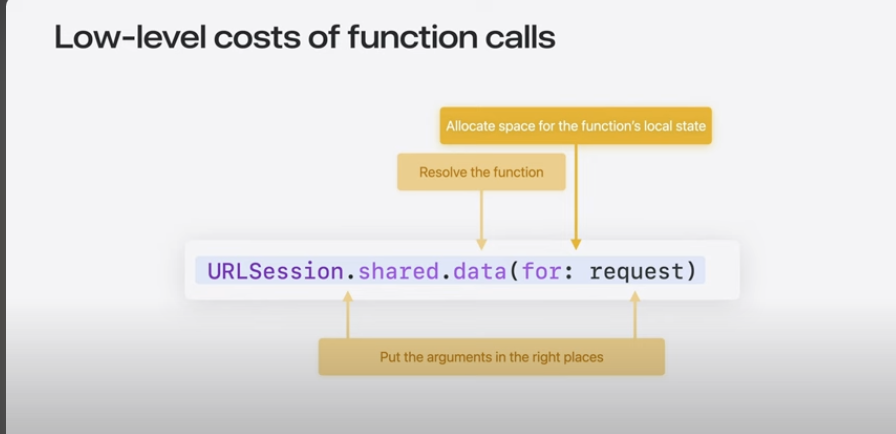
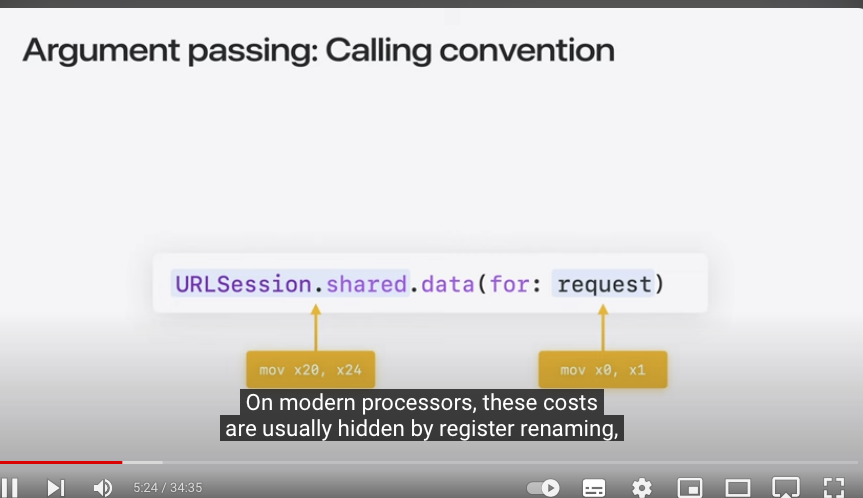
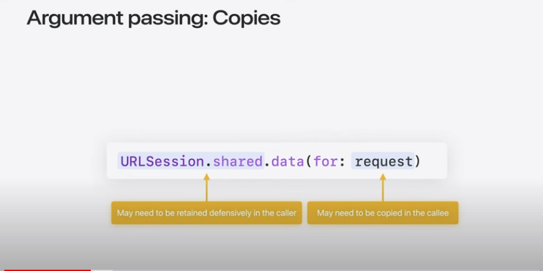
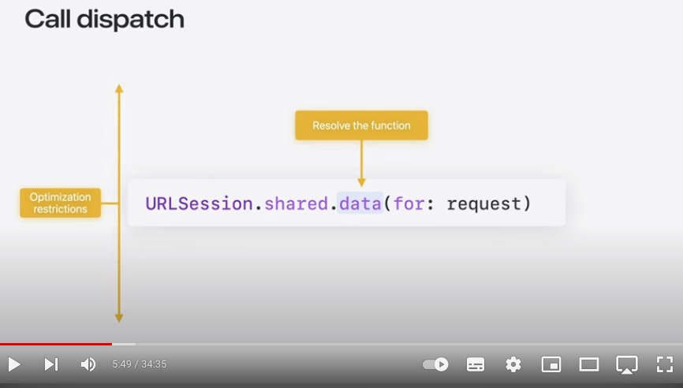
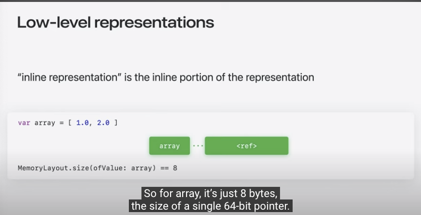
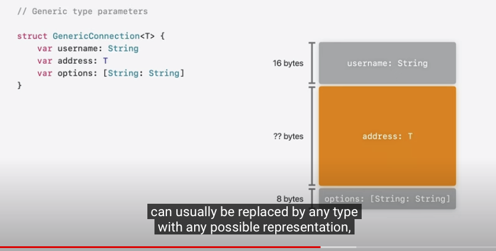
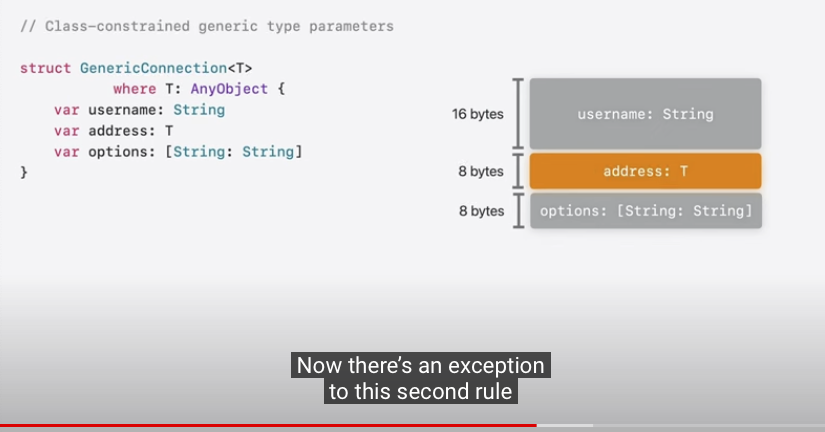
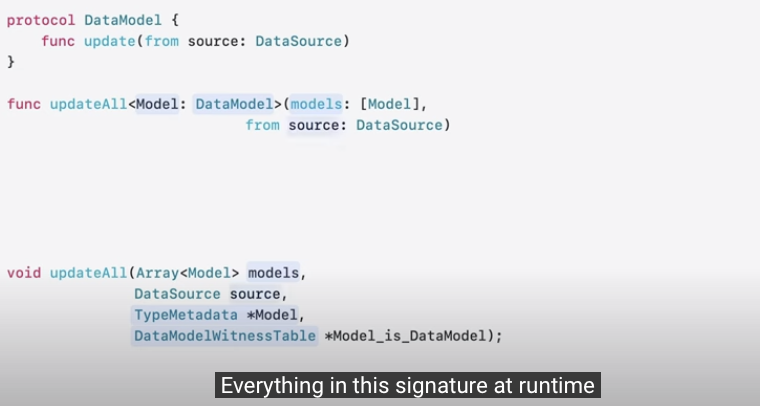
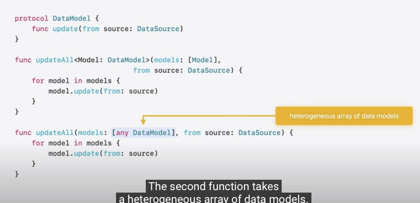

## 여는 말
- 프로그래밍 언어에 대한 직관은 매우 중요합니다. 
- 프로그래머들은 대부분 C로 왔습니다.
- C언어에서는 동적 생성은 Heap, 지역변수는 Stack에 쌓입니다.

- C는 번역된 코드에서 오류가 있으면 전역적인 메모리를 덮어씁니다.   
- Swift에서는 다양한 도구들이 제공되는데(클로, 제너릭, ...), 이러한 추상 툴들은 non-trivial 구현들(malloc을 호출하는 것 만큼 눈에 잘 띄지 않습니다)을 갖고 있습니다.

## Waht is Performace?

- 성능은 다양한 지표를 통해서 결정됩니다.

- Macrospoic Goals(거시적 목표)
  - 레이턴시 줄이기
  - 파워 소모량 줄이기
  - 메모리 제한 지키기
  
### Top Down performace evaluation
- Start from thos macroscopic goals:
  - Instruments를 활용하여 검증하고 확인하기
- 알고리즘적으로 개선을 할 수 있는지 확인하기

### Bottom up performace evaluation

- Foucs on Micoscopic costs:
  - 왜 함수가 오래 걸리는지 검사하기
  - 왜 할당(변수)이 일어나는지와 우리가 무엇을 할 수 있는지 검사하기

### Principles of microscopic performace
- 최적화 되지 않은 함수 호출
- 어떻게 데이터가 보여지는지에 대한 메모리 낭비
- 메모리 할당에 너무 많은 시간
- 값을 복사하는데 너무 많은 시간

|LowLevel|HighLevel|
|:-:|:-:|
|||

### CallDispatch

- Static Dispacth
  - Complier can inline
  - fast
  - Generic Specialize

- Dynamic Dispatch
  - Complier must make conservative assumptions 

### Global Memory
- Allocated and Initailized during program load
- almost free

### Stack Memory
- Allocated and freed by adjusting the C stack potiner
- almost free

### Heap
- allocated and freed with malloc and free
- substantially more expensive

### Refrence counting
- Heap memory often has shared ownership 
- Managed with refrence counting

### About Memory
- 변수 array의 인라인 표현은 실제 버퍼의 내용을 무시하고 단일 버퍼 참조입니다. 표준 라이브러리의 MemoryLayout 타입은 단지 인라인 표현만 측정합니다. 따라서 array의 경우, 이는 단일 64비트 포인터의 크기인 8바이트입니다.

### Array는 한개의 Stored Property를 갖고 있다?(그건 class의)
- sturct, enums and tuples들은 inline storage를 갖고 있음
- inline storage 은 모든 저장프로퍼티들을 보여줌
- 반면 class와 acotr는 out of line storage를 갖고 있음
- inline represenation is just a pointer

### Putting it together

### Dynamically-size-types

- URL은 다이나믹 타입
- Genric 또한 가능
- 팁이 있따면 제너릭을 사용할 때 제너릭이 class라면, Complie Time에 메모리를 알 수 있을 것임

|||
|:-:|:-:|
|||

- 컴파일러는 첫 번째 동적 크기 속성에 도달할 때까지 Connection의 정적 레이아웃을 알고 있습니다. 나머지 레이아웃은 이 프로그램이 타입의 레이아웃을 처음 필요로 할 때 Swift 런타임에 의해 동적으로 채워집니다.
- URL이 24바이트가 되는 경우, Connection은 런타임에 정적으로 알 수 있었던 것처럼 정확하게 레이아웃됩니다. 컴파일러는 단지 상수를 사용할 수 있는 대신 크기와 오프셋을 동적으로 로드해야 합니다.
- 그러나 일부 컨테이너는 반드시 고정 크기를 가져야 합니다. 이러한 경우, 컴파일러는 값을 컨테이너의 주요 할당과 별도로 메모리를 할당해야 합니다.

### Task
- 비동기 함수의 중심 개념은 C 스레드가 소중한 자원이므로, 단지 블록하기 위해 C 스레드를 유지하는 것은 그 자원을 잘 활용하지 못하는 것입니다. 
- 그 결과, 비동기 함수는 두 가지 특별한 방식으로 구현됩니다. 
- 첫째, 로컬 상태를 C 스택과 별도의 스택에 유지하고
- 둘째, 런타임에 여러 함수로 나누어집니다.
- 전체 성능 프로파일은 동기 함수와 유사하지만 호출의 오버헤드가 약간 더 높습니다.
- 실제로 실행되기 위해, 비동기 함수는 함수의 잠재적인 중단 지점 사이를 걸치는 부분 함수로 나누어져야 합니다. 이 경우, 함수에 하나의 await가 있으므로 두 개의 부분 함수가 생성됩니다.
- 하나의 부분 함수로 들어가서 다음 잠재적인 중단 지점까지 일반적인 C 함수처럼 실행됩니다. 부분 함수가 중단 지점을 넘지 않는 로컬 상태를 필요로 하면, 이를 C CallFrame에 할당할 수 있습니다.
  

- 첫 번째 부분 함수는 원래 함수의 진입점에서 시작합니다. 배열이 비어 있으면 비동기 호출자로 반환됩니다. 그렇지 않으면 첫 번째 태스크를 가져와 await합니다.
- 다른 부분 함수는 그 await 이후에 시작합니다. 먼저 대기한 태스크의 결과를 출력 배열에 추가한 다음, 루프를 계속 시도합니다. 더 이상 태스크가 없으면 비동기 호출자로 반환됩니다. 그렇지 않으면 다음 태스크를 대기하면서 루프를 계속합니다.
- 그 시점에서 부분 함수는 다음 부분 함수를 꼬리 호출(tail-call)합니다. 이전 CallFrame은 C 스택에서 사라지고 다음 부분 함수의 프레임이 할당됩니다.
- 그런 다음, 부분 함수는 잠재적인 중단 지점에 도달할 때까지 실행됩니다.
- 태스크가 실제로 중단해야 할 때, 이는 단순히 C 스택에서 정상적으로 반환되며, 이는 일반적으로 바로 동시성 런타임으로 이어져 스레드를 즉시 다른 작업에 재사용할 수 있게 합니다.

### Closure
- 클로저는 enclosing scope를 캡쳐 합니다.
- 컨텍스트는 단순히 캡처된 값을 포함하는 간단한 구조체가 됩니다.
- 컨텍스트는 스택에 할당될 수 있으며, 해당 주소가 클로저에 전달됩니다.
- 클로저는 heap에 할당되고 retain and releases를 관리 받습니다.
- 클로저는 단지 값의 주소들을 캡쳐하고 할당하는 것입니다. 

### Generices

-  제네릭 함수에서는 타입과 증인 테이블이 숨겨진 추가 매개변수가 됩니다. 런타임의 시그니처에 있는 모든 것은 원래 Swift 시그니처의 일부와 직접적으로 대응됩니다.

-  첫 번째 함수는 동질적인 데이터 모델 배열을 받습니다. 이 데이터 모델들은 배열에 효율적으로 채워질 것입니다. 타입 정보는 함수에 한 번만 최상위 수준의 인수로 전달됩니다.
-  두 번째 함수는 이질적인 데이터 모델 배열을 받습니다. 이는 더 유연해서, 다양한 타입의 데이터 모델을 가지고 있다면 필요할 수 있습니다. 그러나 이제 배열의 각 요소는 자체 동적 타입을 가지며, 값들이 배열에 밀집되어 있지 않을 것입니다.