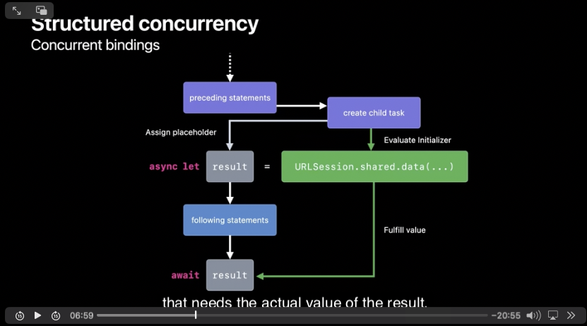

# 개요(Swift - Concurency가 만들어 진 이유)
과거 프로그래밍 언어에서는 인스트럭션들 때문에 이곳 저곳으로 이동했음. 이 떄문에 읽기 매우 어려웠음.
하지만 현재 언어에서는 이런 것들을 지원해줌. Swift Task(비동기)도 비슷한 형태로 지원해줌


# Structured  Control-flow can be sequenced

- 이렇게 Structured 한 Code는 top to bottom 으로 진행됨(읽어짐)
- **하지만**비동기 코드들은 이렇게 Structuredg 하지 않음
- call back handler 가 그 예시임 (비동기 이후에 작업들을 하는 것을 생각하기)
- async/await을 활용하면 Structured한 코드를 만들 수 있음.


# Sequential bindings vs Concurrent bindings
|Sequential bindings|Concurrent bindings|
|:-:|:-:|
||

### Concurrent bindings이 어떻게 될까?(순서대로)

- 비동기 바인딩을 위해 Child Task 생성
- Child Task에서 동시에 두가지를 실행합니다.
  - Assign PlaceHolder
  - Evaluate initializer
- Parent 작업은 계속 진행됨
- Child 작업이 진행되고 실제 값이 필요한 경우가 되면, child Task를 await 한다.


### What is Child Task?

```swift
func fetchOneThumbnail(withID id: String) async throws -> UIImage {
    let imageReq = imageRequest(for: id), metadataReq = metadataRequest(for: id)
    async let (data, _) = URLSession.shared.data(for: imageReq)
    async let (metadata, _) = URLSession.shared.data(for: metadataReq)
    guard let size = parseSize(from: try await metadata),
          let image = try await UIImage(data: data)?.byPreparingThumbnail(ofSize: size)
    else {
        throw ThumbnailFailedError()
    }
    return image
}
```

- `async let` 으로 묶인 data, metaData가 불려오는 과정들이 Child Task 이다.
- parent Task는 Child Task가 끝나야 비로소 끝날수 있다.(Rule임)
- Parent 내부 ChildTask가 비정상 종료시(throw), 예정되어있던 Task를 cancle시키고, function이 exiting전에 종료시킴.
- 위에서 말한 예정되어있던 Task는 비정상 종료의 Strucured Task입니다.


# 작업이 최종적으로 언제 중지될까요? 

### 작업 취소를 만들어야 하는 이유
- 동기 함수이든 아니든, 현재 작업의 취소 상태는 어떤 함수에서도 확인할 수 있습니다. 
- 이는 특히 시간이 오래 걸리는 계산을 수행하는 경우, 취소를 고려해 API를 구현해야 한다는 의미입니다. 
- 사용자는 취소될 수 있는 작업에서 코드를 호출할 수 있으며, 이러한 경우 계산이 가능한 한 빨리 중단되기를 기대할 것입니다.

```swift
func fetchThumbnails(for ids: [String]) async throws -> [String: UIImage] {
    var thumbnails: [String: UIImage] = [:]
    for id in ids {
        if Task.isCancelled { break }
        thumbnails[id] = try await fetchOneThumbnail(withID: id)
    }
    return thumbnails
}
```

# GroupTask (비동기 병렬 처리 방법)

```swift

//MARK: - Cause Data Race 🥲
func fetchThumbnails(for ids: [String]) async throws -> [String: UIImage] {
    var thumbnails: [String: UIImage] = [:]
    try await withThrowingTaskGroup(of: Void.self) { group in
        for id in ids {
            group.async {
                // Error: Mutation of captured var 'thumbnails' in concurrently executing code
                thumbnails[id] = try await fetchOneThumbnail(withID: id)
            }
        }
    }
    return thumbnails
}
//MARK: - Prevent Data Race 👍
func fetchThumbnails(for ids: [String]) async throws -> [String: UIImage] {
    var thumbnails: [String: UIImage] = [:]
    try await withThrowingTaskGroup(of: (String, UIImage).self) { group in
        for id in ids {
            group.async {
                return (id, try await fetchOneThumbnail(withID: id))
            }
        }
        // Obtain results from the child tasks, sequentially, in order of completion.
        for try await (id, thumbnail) in group {
            thumbnails[id] = thumbnail
        }
    }
    return thumbnails
}
```


- Data Race를 막기 위해서, Swift는 Static Checking 제공
- 클로저 결과를 넘길 때 Sendable을 채택하면 좋음.

# Unstructred tasks

- Not all tasks fit a strucutured pattern (uikit, appkit delegate)
- some Tasks need to launch from non-async contexts
- Some tasks live beyond the confines of single scope