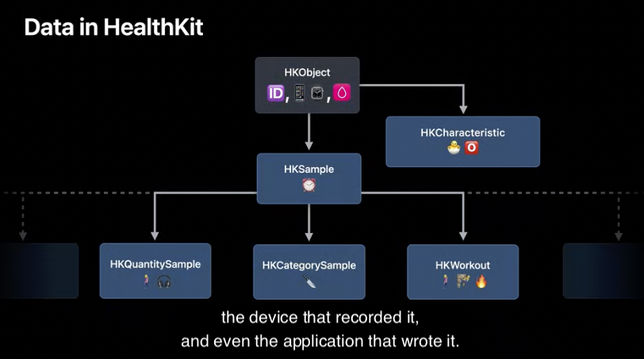

 ## HealthData의 특징
 - 헬스 데이터들은 개인적인 요소로 구성됩니다. 
- "우리 자신의 건강 데이터에 쉽게 접근할 수 있게 된 것은 현대 기술의 가장 강력한 발전 중 하나이다."(강연자 생각)

 

## HealthKit 특징
- 유저의 healthData를 중앙에서 관리하는 저장소 역할을 한다.
- 어플리케이션의 읽기 허용과, 기여(쓰는거)를 담당한다.
- MultiDevices 지원함.(Iphone, AppleWatch, iCloud)

 

## HealthKit데이터를 사용하기 위해서

1. Application Access를 줘야 한다.
2. platform availability 확인해야 한다.
3. HKHealthKitStore를 init해야 한다.

|1|2|3|
|:-:|:-:|:-:|
| | ||

 

## 다양한 것들이 Health Samples로서 저장된다.

- Workout, walked, audio levels, 등등...
- MetaData는 추가적인 정보들을 나타냅니다.
        

## Quantity Samples
- Numeric Value와, Unit을 저장함.

## 사용자에게 권한을 요청하기
- 사용자가 personal 정보를 공유하는 것이기 때문에 매우 중요합니다.
- 또한 infoplist에서 왜 필요한지에 대해 정의할 수 있습니다.
- 애플에서는 Authroization을 요청하는 그 **타이밍**이 중요하다고 말 합니다.

 

## Save Walking Distance

- 목표
    1. Request Write Access
    2. Create Sample
    3. Save the Sample to HealthKit

**데이터 권한 요청하기** 

**데이터 샘플 생성하기 / 저장하기**

 

## HK에서 저장하는 데이터에 대한 것들

- `HKQuantitySample`같은 경우는 Unit및 Numerical Value가 저장됨
- `HKCategorySample`은 List of values임.
- `HKWourout`은 다양한 정보들이 요약되어 저장됨.(칼로리, 달린거리, 에너지 등...)
- 이들은 모두 `HKSample`을 상속 받음
- `HKCharacteristic`은 생년월일, BloodType같은 것들을 관리함

|1|2|3|
|:-:|:-:|:-:|
||||

 

## Reading Data = Query
- 쿼리 사용을 위해서는 다음의 일련의 과정들이 수반되어야 합니다.
    1. 쿼리 구성하기(type of Data, predicate)
    2. 쿼리 실행하기
    3. 쿼리 결과 Handler를 통해서 Task 구성하기
- predicate로 필터링과 함꼐 성능을 향상시킬 수 있습니다. 

 

## HKStatisticsQuery에 다양환 데이터 타입

- Sum
  - 달리기 혹은, 칼로리 소모량, 물 마신 횟수
- Average, Minimum, Maximum
  - UV 노출, HeartRate, Temperature

- 중복되는 데이터를 쿼리가 제거해 줍니다. 

 

## HKStatisticsCollectionQuery에 대해서 
- HKStatisticsQuery를 Collection한 것으로 생각하면 됩니다.

- 또한 User의 Update를 추적하고 싶을 수 있습니다.
  - 이럴 때 Update Handler를 설정해 주면 됩니다.

 

## 코딩하기

ViewWillApppear에서 HealthKit 권한 요청하는 로직

실제 읽을 데이터 구하는 로직

만약 데이터가 Update될 경우 statisticsUpdateHandler를 설정하면됩니다.

그리고 update하는것을 그만두고 싶다면, healthStore.stop을 호출하면 됩니다.

## 다양한 쿼리들
- HKAnchoredObjectQuery: 데이터가 바뀌는 것을 Track하는 Query
- HKActivitySummaryQuery: AppleWatch 액티비티링에 관한 쿼리
- HKWorkoutRouteQuery: 아웃도어 워크아웃들에 대한 Location을 관리하는 쿼리

 

### 끝나고 공부할 것
1. HeartBeat query
2. CollectionQuerry의 options 