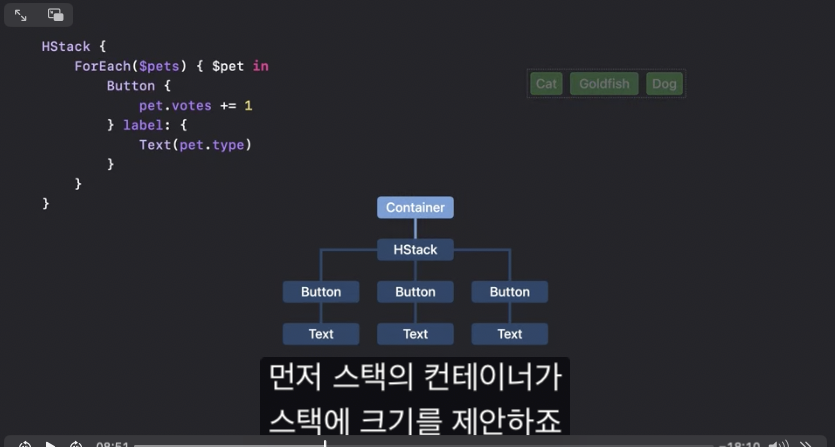
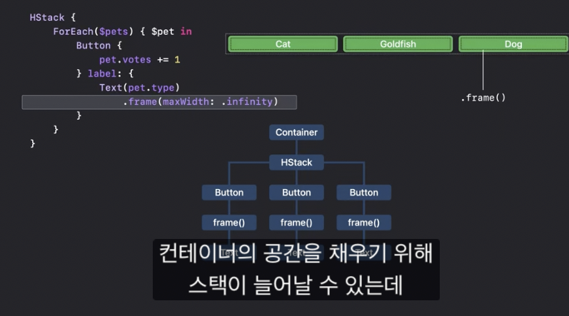

### LazyHGrid, LazyVGrid
SwiftUI는 이 LazyHGrid, LazyVGrid가 있어서 스크롤컨텐츠에 적합합니다. 
이 컨테이너는 뷰가 많을 때 매우 효과적입니다. 보이는 곳만 렌더링 하기 때문입니다. 

하지만 셀의 높이와 폭을 자동으로 조절할 수 없습니다.

예를 들어서 LazyHGrid는 열의 폭을 계산할 수 있는데, 뷰가 렌더링되기 전에 높이를 측정하기 때문입니다. 
하지만 모든 LazyHGrid안에 있는 컨텐츠들을 측정하여 Frame을 계산할 수 없습니다.

### Grid
스크롤할 필요가 없으며, 각 셀의 높이를 계산할려면 Grid를 사용합니다. 모든 뷰를 한번에 로딩하여 열과 행에 맞춰서 자동으로 셀의 크기를 조정하고 정렬니다.

### GridRow
gridColumnAligment(.)

```swift
struct Leaderboard: View {
    var pets: [Pet]
    var totalVotes: Int

    var body: some View {
        Grid(alignment: .leading) {
            ForEach(pets) { pet in
                GridRow {
                    Text(pet.type)
                    ProgressView(
                        value: Double(pet.votes),
                        total: Double(totalVotes))
                    Text("\(pet.votes)")
                        .gridColumnAlignment(.trailing)
                }
                GridRow {
                    Divider().gridCellColumns(3)
                }
                
            }
        }
        .padding()
    }
} 
```


### HStack의 크기를 정하는 방법(좋은건 다시보자)



1. 컨테이너가 스택에 크기를 제안한다. 
2. 이걸 토대로 스택은 3개의 버튼 크기를 제안한다.
3. 각 버튼은 해당 크기를 텍스트 레이블에 전달한다. 
4. 텍스트뷰는 실제로 원하는 크기를 계산한다.(뷰에 담긴 String을 기준으로 계산함.)
5. 계산한 정보를 Button에게 올림
6. Button은 계산한 정보를 다시 HStack에게 올림
7. 스택은 이 정보를 토대로 크기를 변경하고, 각 공간에 버튼을 배치한 뒤 스택에 크기를 컨테이너에 올린다.



텍스트를 바꾸지 않았지 버튼에 유연한 서브뷰가 있어서 HStack이 제공하는 최대 공간을 차지하게 할 수 있습니다. 
이 경우 Button들은 같은 너비를 가지면서, 너비는 Stack에 사이즈에 의존합니다. 


### 같은 폭의 크기의 버튼을 맞추는 방법(Using Layout)

```swift
struct MyEqualWidthHStack: Layout {
    func sizeThatFits(
        proposal: ProposedViewSize,
        subviews: Subviews,
        cache: inout Void
    ) -> CGSize {
        // Return a size.
    }

    func placeSubviews(
        in bounds: CGRect,
        proposal: ProposedViewSize,
        subviews: Subviews,
        cache: inout Void
    ) {
        // Place child views.
    }
}
```

레이아웃 프로토콜에는 필수적인 2개의 매서드만 있으면 됩니다.

### SizeThastFits

첫번째 매서드는 `sizeThatFits`이며, 레이아웃 컨테이너 크기를 계산하고 보고합니다. 
첫번째 인자인 `proposal`은 레이아웃 컨테이너 뷰에서 제안하는 크기 입니다. 
그리고 두번째 인자인 `subviews`들에서도 크기를 제안합니다. `subviews`에는 직접적으로 접근하지 못하지만 `subview proxy`를 통해서 상호작용 합니다. 이러한 방식으로 크기제한이 이루어집니다. 

subviewProxy는 하위뷰의 제안을 바탕으로 정확한 크기를 반환합니다. 이를 이용하여 eqaulWidthHStack의 정확한 크기를 컨테이너에 반환하면 됩니다. 

### placeSubviews
인자인 `proposal`, `subview`는 Proposal을 위해 사용됩니다.
인자인 `bounds`는 서브뷰의 배치에 활용합니다.  

### 두 매서드 안에 있는 `cache: inout void`

양방향 캐시인데, 이는 매서드 호출에 걸친 중간 계산 값을 공유합니다.

### 직접 구현해보기
특정 크기를 제안하지 않은 이상적인 크기를 가져오는 코드 입니다. 또한 maxSize를 계산합니다. 
```swift
func sizeThatFits( ... ) -> CGSize {
    let subViewSize = maxSize(subviews: subviews)
}

private func maxSize(subviews: Subviews) -> CGSize {
    let subviewSizes = subviews.map { $0.sizeThatFits(.unspecified) }
    let maxSize: CGSize = subviewSizes.reduce(.zero) { currentMax, subviewSize in
        CGSize(
            width: max(currentMax.width, subviewSize.width),
            height: max(currentMax.height, subviewSize.height))
    }

    return maxSize
}
```

만약 subviews의 간격을 주고 싶다면 어떻게 해야할까? 사실 모든 뷰들은 각각의 간격이 있다.(apple에서 제공하는)

### Size That Fits 리턴해봐

우리가 구한 것들을 토대로 Size를 return할 수 있다. 

```swift
func sizeThatFits(
    proposal: ProposedViewSize,
    subviews: Subviews,
    cache: inout Void
) -> CGSize {
    // Return a size.
    guard !subviews.isEmpty else { return .zero }

    let maxSize = maxSize(subviews: subviews)
    let spacing = spacing(subviews: subviews)
    let totalSpacing = spacing.reduce(0) { $0 + $1 }

    return CGSize(
        width: maxSize.width * CGFloat(subviews.count) + totalSpacing,
        height: maxSize.height)
}

func placeSubviews(
    in bounds: CGRect,
    proposal: ProposedViewSize,
    subviews: Subviews,
    cache: inout Void
) {
    // Place child views.
    guard !subviews.isEmpty else { return }
  
    let maxSize = maxSize(subviews: subviews)
    let spacing = spacing(subviews: subviews)

    let placementProposal = ProposedViewSize(width: maxSize.width, height: maxSize.height)
    var x = bounds.minX + maxSize.width / 2
  
    for index in subviews.indices {
        // 이를 통해서 각 간격마다 subview를 배치하게 만듭니다. 
        subviews[index].place(
            at: CGPoint(x: x, y: bounds.midY),
            anchor: .center,
            proposal: placementProposal)
        x += maxSize.width + spacing[index]
    }
}
``` 