# `#expect`를 활용하여 do throws 최적화 하기

테스트 코드안에 do catch가 공존할 경우 코드를 읽기 힘들어짐
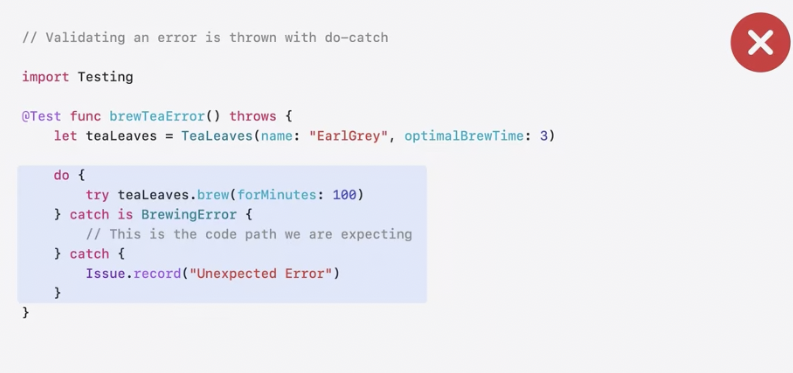

하지만 `#expect(throws: )`를 활용하여 사용자가 원하는 에러가 발생했는지에 대해서 검증할 수 있습니다.  Error가 발생하지 않거나, BrewingError가 발생하지 아닐 경우 test에 실패합니다. 또한 정말 원하는에러가 발생하는지에 대해서도 체크할 수 있습니다.(`#expect(throws: MyError.myCase)`)
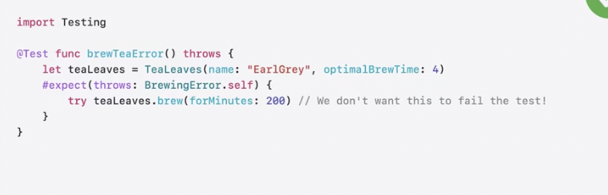

오류 유효성 검사를 맞춤화해 특정 타입이나, 오류 사례 연결된 값 또는 속성이 올바른지 여 또는 코드에서 발생한 오류가 작업에 맞는 오류인지 확인하는 등 다양한 것들이 가능해 잡니다.   
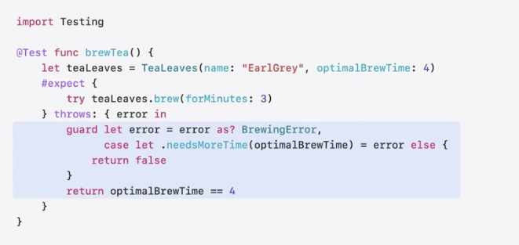

## `Require`을 활용하기
optional value를 `require`를 활용하여 optional unwrapping을 진행할 수 있습니다. 
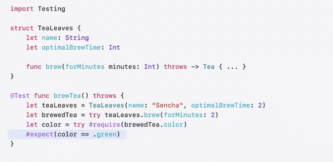

## withKownIssue로 테스트 중지하기
withKnwonIssue를 활용해 현재 문제가 되고 있는 부분을 일시적으로 테스트하지 않을 수 있습니다.    
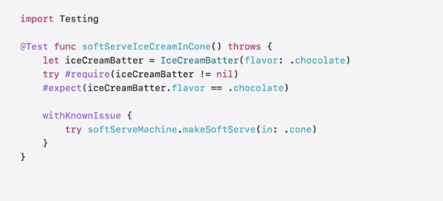

# Tag를 활용하기
Tag는 객체뿐만 아니라 함수 코드 레벨에서도 적용 가능합니다. extension을 활용하여 tag를 묶을 수 있고 이를 `@Suite`에 활요할 수 있습니다.

|single Tag| multiple tags|
|:-:|:-:|
|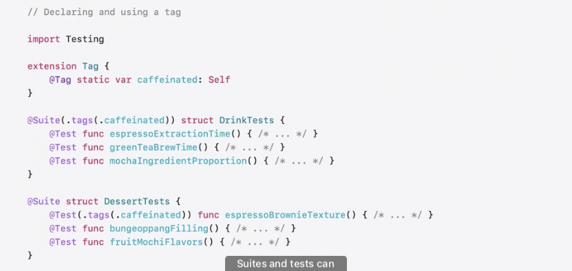 | 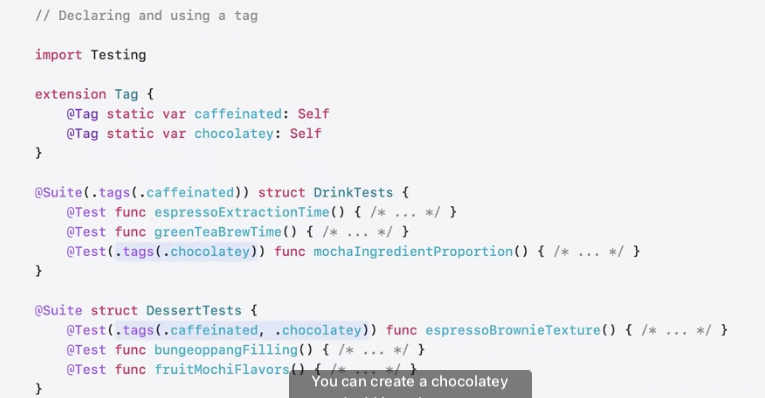|

## Exclude Tag
만약 특정 태그를 제외하여 테스트를 실행하고 싶다면 exclude tag항목에 적어 넣으면 됩니다.

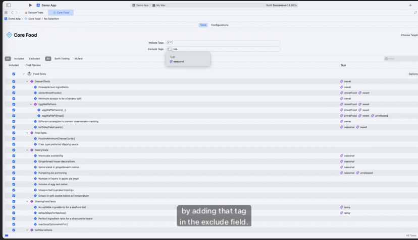

## Xcode Cloude에서 Swift testing을 지원하도록 업데이트 되었습니다.
테스트 모음의 결과를 appstore connect의 xcode cloude에서 확인할 수 있도록 되었습니다. 

# Testing in Parallel
## Basic
여태까지는 테스들이 직렬로 실행되었습니다. 하지만 SwiftTesting은 병렬적으로 실행되도록 변경하였습니다. 이는 XCTest와 다른점중 하나 입니다. 

|as is|to be|
|:-:|:-:|
|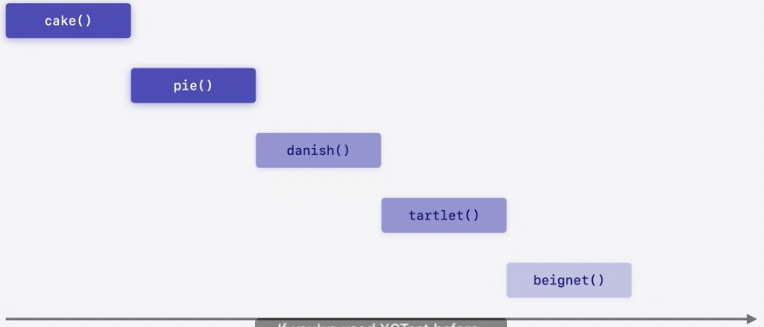|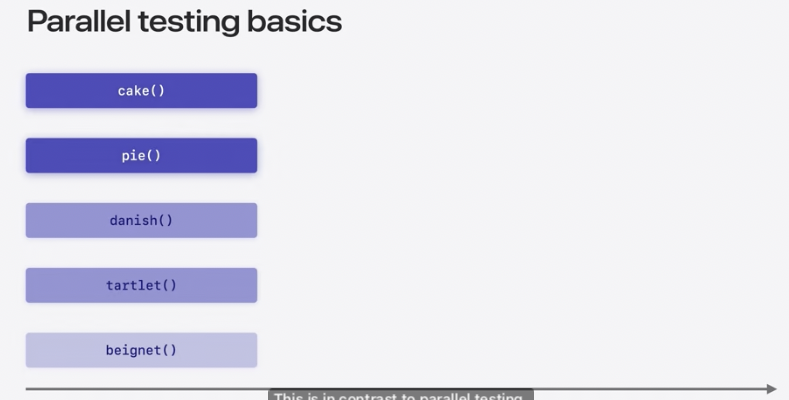|

장점
  - 시간 절약할 수 있습니다.
  - 의도하지 않은 종속성을 발견할 수 있습니다. 

|Excution time saved|find hidden dependencies|
|:-:|:-:|
| 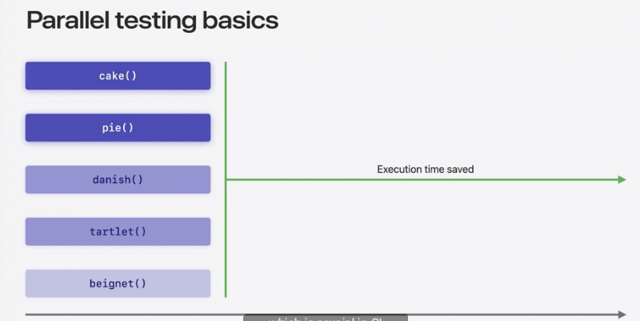| 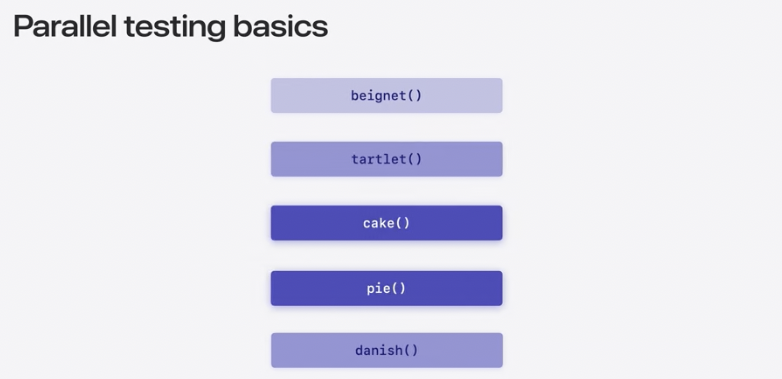 |

## 직렬로도 실행 가능함 
이렇게도 가능하지만, 리팩토링 하는 것을 추천한다고 합니다. 
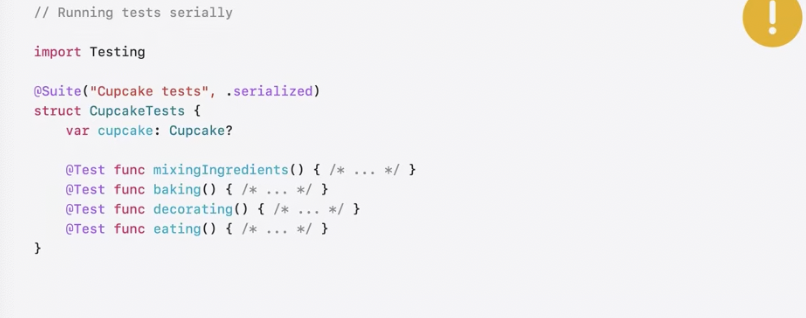

## Async활용하기
SwiftTesting을 활용하여 asnyc throws함수를 쓸 수 있습니다. 하지만 compleciton handller의 경우 테스트에 성공했는지 아닌지에 대해서 알 수 없습니다. (함수가 끝나버리기 때문) 따라서 await을 활용하여 끝나기 전까지 기다리는게 좋습니다.
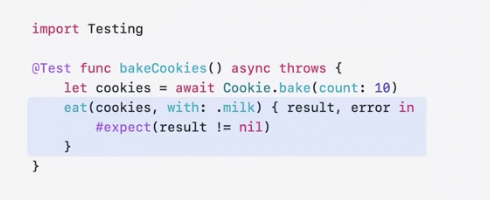

## confirmation을 활용하여 클로저가 몇번 실행되었는지 추적하기
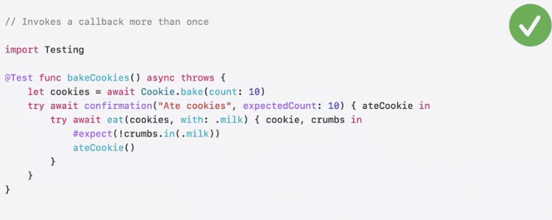