### Test에 대해서 
Test는 품질과 안정성 측면에서 중요합니다.

## Swift Testing에 Powerfull capabilites
- Descriptive, organized tests
- Actionable failures
- Scalable
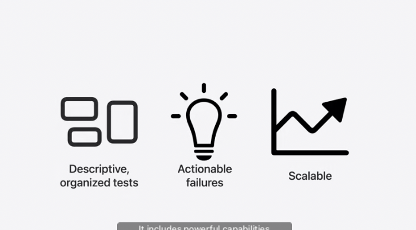

## Buildilng blocks(구성요소)
- xcode 16부터는 SwiftTesting이 default Template이 된다.(XCTest이 아닌)
- 실제 코드 작성 과정
  1. test모듈 불러오기 (import Testing)
  2. global test function 작성하기
  3. function 앞에 macro `@Test`작성하기
  4. `@testable import MyModule`
  5. `#expect()`를 통해 검증

### TestFunction에 특징
- `@Test`로 작성
- 글로벌 함수에서 가능함
- asnyc throws 지원
- Actor-isolated지원

### Expectations Validate expected conditions
- Use `#expect` to validate
- Operator를 활용해 수식을 표기 가능합니다.
- 실패할 경우 소스코드와 하위 표현식 값을 캡쳐합니다. 

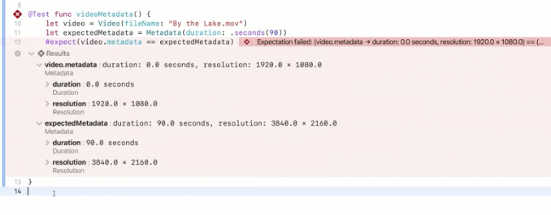

## Flexiblae expect macro
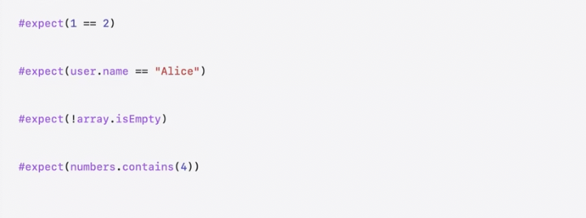

## Require 매크로
만약 Failure가 발생해서 일찍 테스트를 종료하고 싶다면 Require 매크로를 활용하면 됩니다. 
 
|기본 사용| optional unwrapping|
|:-:|:-:|
|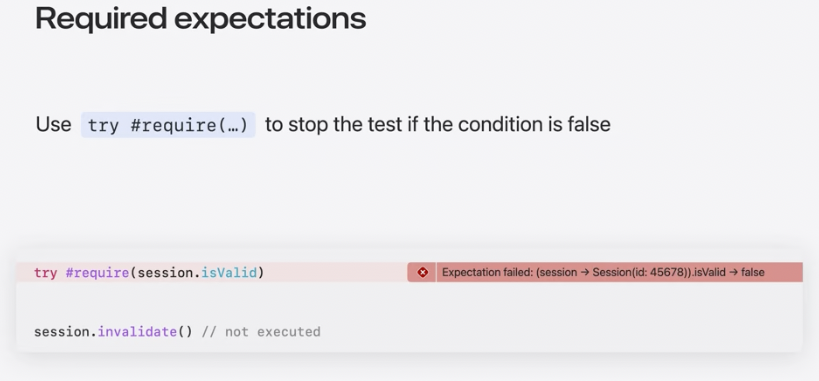|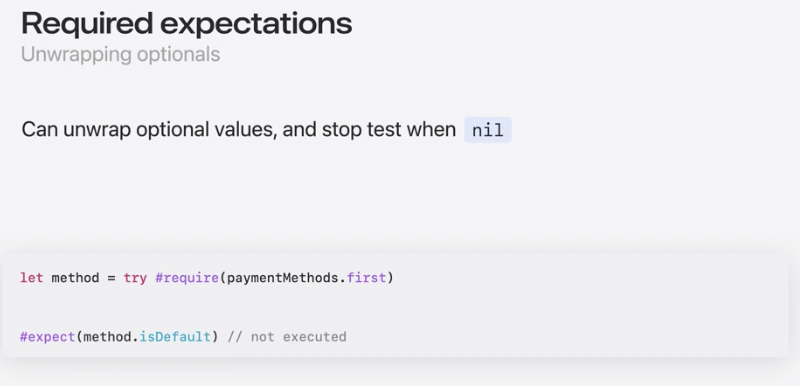|

## Built-in traits
Built in traits을 활용하여 테스트가 어떤 목적인지 설명할 수 있습니다. 또한 컨디션에 따라 실행하게 할지 말지에 관해 결정할 수 있습니다. 
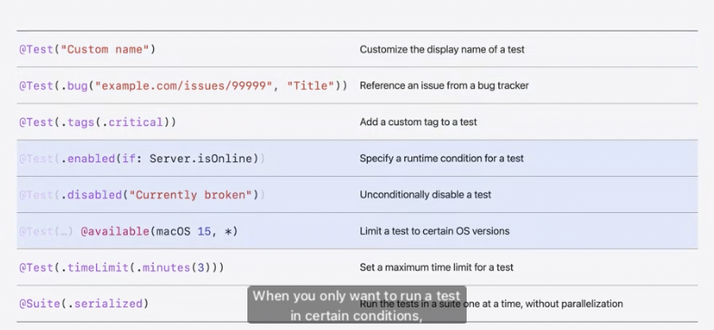

## Suites
Suites 테스트와 관련된 그룹들을 관리하는데 활용되빈다. @Suite속성으로 주석을 달 수 있습니다. 또한 Suite은 stored intstance를 가질 수 있습니다. `init`, `deinit`을 활용하여 set-up, tear-down logic을 활용할 수 있습니다. 

# Common Workflows
 
### Runtime conditions에 종속된 테스트
`@Test(...)`에 조건을 활용하여 테스트시행 여부에 관해 manuplate할 수 있다. 
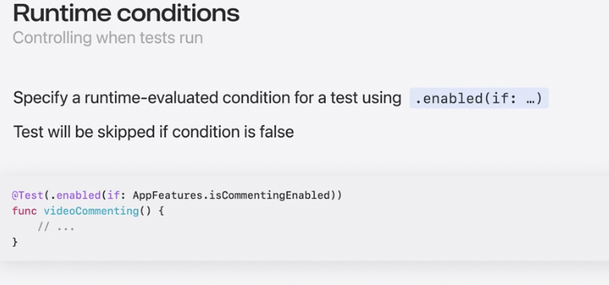

실제 테스트 구현체에 available을 활용하는 것은 추천되지 않는 방법 입니다.
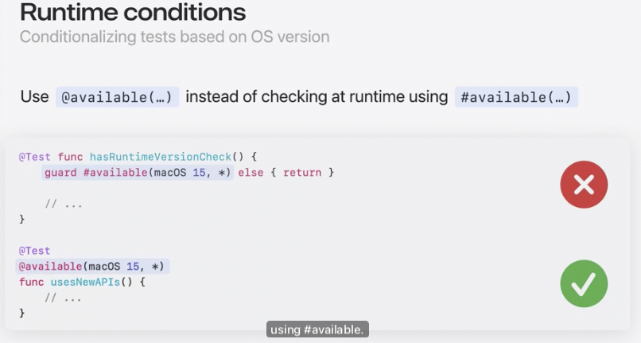

### Tag를 활용한 공통된 테스트 분류하기
`@Test(...)`에 적정 태그를 넣어 공통된 테스트들을 분류합니다. 

|함수 개별로 설정| Suites를 통해 설정|
|:-:|:-:|
|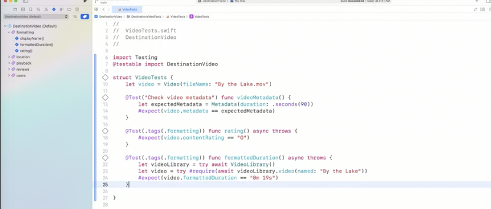|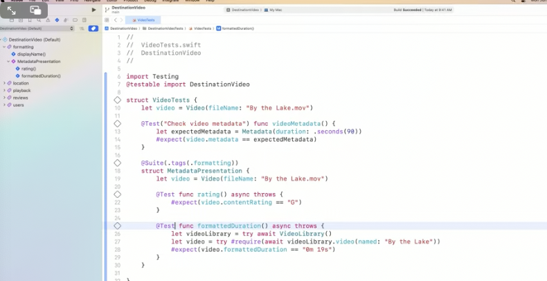|

## Test tags 특징
 - 특정 태그를 개별로 실행할 수 있습니다. 
 - Tage를 통해 Filter링 할 수 있습니다. 
 - 프로젝트 끼리 공유가 가능합니다. 

## Test tags recommended practices
- Swift Testing을 사용할 때는, 테스트 계획에 특정한 이름보다 태그를 포함시키거나 제외하는 것이 더 좋습니다
- 가장 적절한 trait type을 활용합니다. 

# 다양한 argument를 활용하는 테스트들에 대해서 
`@Test(arguments: [...])`를 활용하여 반복되는 보일러 플레이트 코드를 줄일 수 있습니다.
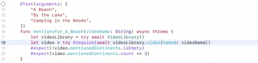

또한 다양한 arguments를 넣었을 때 실패하는 케이스에 대한 설명도 볼 수 있습니다.
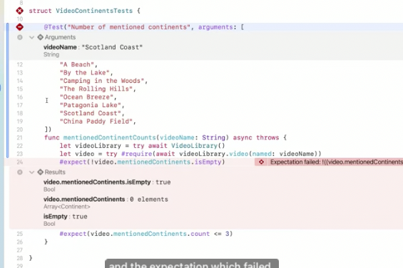

## Parameterized testing 특징
- 각 arugment의 디테일을 볼 수 있습니다.
- 디버그 하기 위해 Re-run할 수 있습니다. 
- 병렬적으로 테스트가 동작합니다. 

# XCTest와 연관된 것들
- XCTest와 다른점들이 존재합니다. 
  - Swift Test는 다양한 종류의 함수를 지원함
  - Swift Test는 Traits을 활용할 수 이씀 
  - XCTest는 simulator에서 동작, SwiftTest는 device를 활용하여 진행함
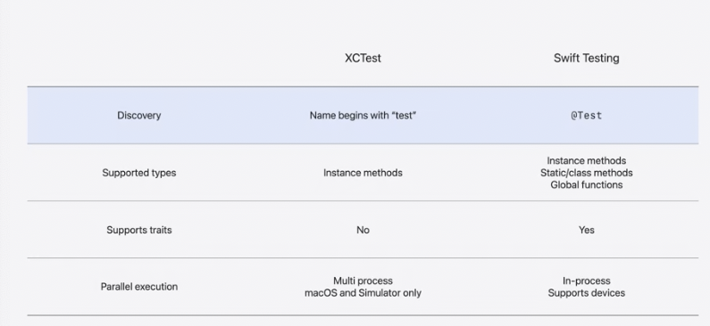

- 그리고 비교하는 것에 엄청 큰 차이가 남 
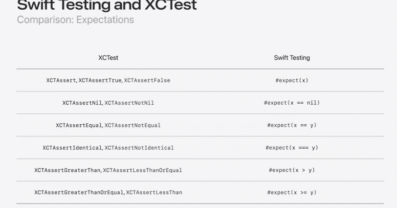

- 테스트를 멈추는 것에서도 차이가 있음
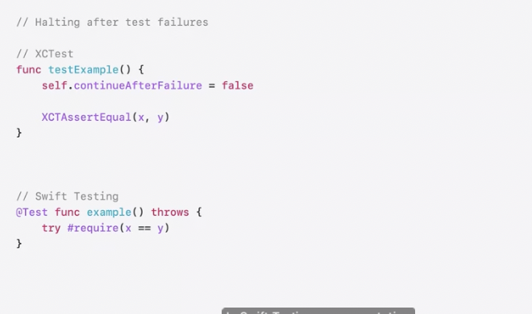

- Suites에 대한 차이점
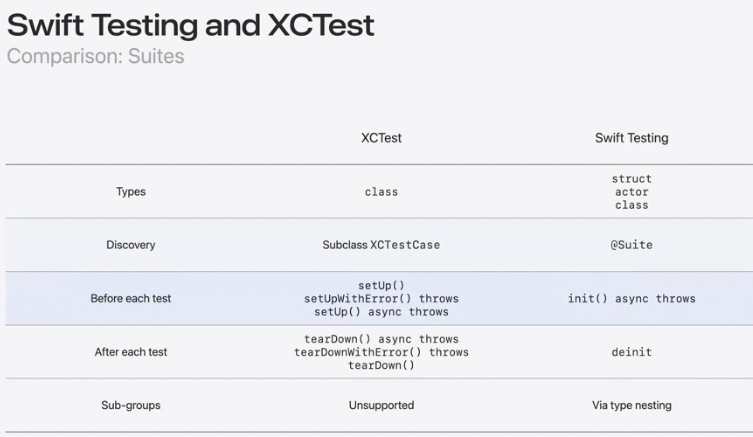